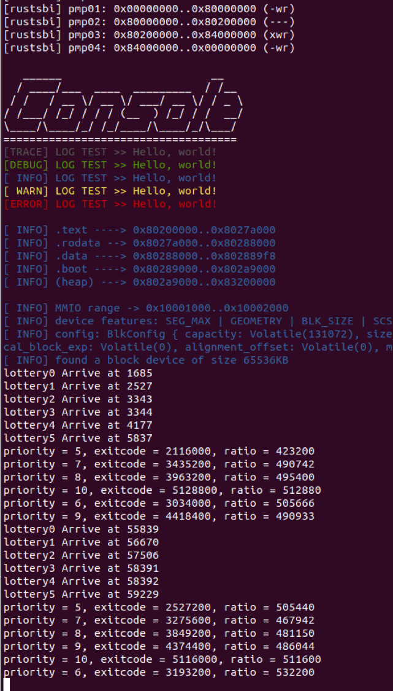
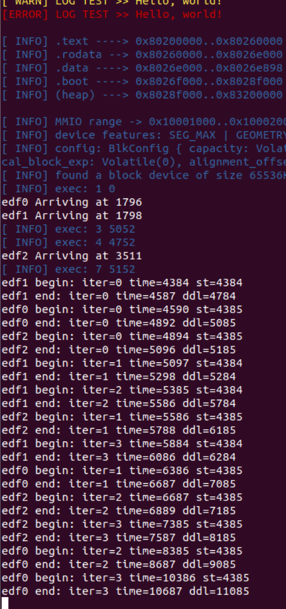

# 调度算法
实现了 SJF(短作业优先)，STCF(最短剩余时间优先)，HRRN(最高响应比优先)，stride(步长)，lottery(彩票)，MLFQ(多级反馈队列)，EDF(最早截止时间优先)，RMS(速率单调算法) 共 8 种调度算法。

## 实验
### SJF, STCF 和 HRRN
测试包含 5 个进程，预期执行时间如下：

| proc name | time |
| -- | -- |
| sjf1 | 10000 |
| sjf2 | 100000 |
| sjf3 | 3000 |
| sjf4 | 1200 |
| sjf5 | 1100 | 

sjf1、sjf2 和 sjf3 同时到达，sjf4 比 sjf3 晚 1000 ms 到达，sjf5 比 sjf4 晚 1000 ms 到达。

对于 SJF，在仅有 sjf1、sjf2 和 sjf3 到达时，运行 sjf3，sjf4 到达后，由于其运行时间更短，发生抢占，sjf5 到达后同样发生抢占。如图：

对于 STCF，在仅有 sjf1、sjf2 和 sjf3 到达时，运行 sjf3。sjf4 到达后，其剩余时间 1200 ms，大于 sjf3 的 3000 - 1000 = 2000 ms，因此发生抢占。但 sjf5 到达时，其剩余时间为 1100 ms，大于 sjf4 的 1200 - 1000 = 200 ms，因此不发生抢占。如图：

对于 HRRN，其每次调度寻找响应比最高的进程。响应比的计算方式是：

$$
    ratio = 1 + \frac{等待时间}{预期执行时间}
$$

因此出现 sjf3, sjf4，sjf5 的交替执行，如图：

### stride 和 lottery
测试包含 6 个进程（stride0 到 stride5），优先级依次为 5 到 10，每个进程约耗时 40 s。计算出每个进程被调度的次数，预期调度次数应当大致相同。

stride 的结果如下：

lottery 的结果如下：

### MLFQ
测试包含 3 个进程：mlfq3，mlfq4 和 mlfq5。3 个进程的运算内容基本一致，区别在于 mlfq4 模拟了前台进程，因此完成一部分计算后就会短暂休眠，而 mlfq3 和 mlfq5 模拟了后台进程，不休眠。

总体来看 mlfq4 的优先级更高，因此更快完成。如图：

### EDF 和 RMS
测试均包含 3 个进程：edf0, edf1, edf2 及 rms0, rms1, rms2。两组进程的周期和初始截止时间均为如下：

| proc no. | period | init ddl |
| -- | -- | -- |
| 0 | 2000 | 700 |
| 1 | 500 | 400 |
| 2 | 1000 | 800 |

每个任务执行 4 个周期，如果出现超时则报错并异常退出。

使用 EDF 算法的理论结果如下：

实际结果与理论一致，未出现超时情况：

使用 RMS 算法的理论结果如下：

rms0 将在第一次执行时超时。实际结果与理论一致：

